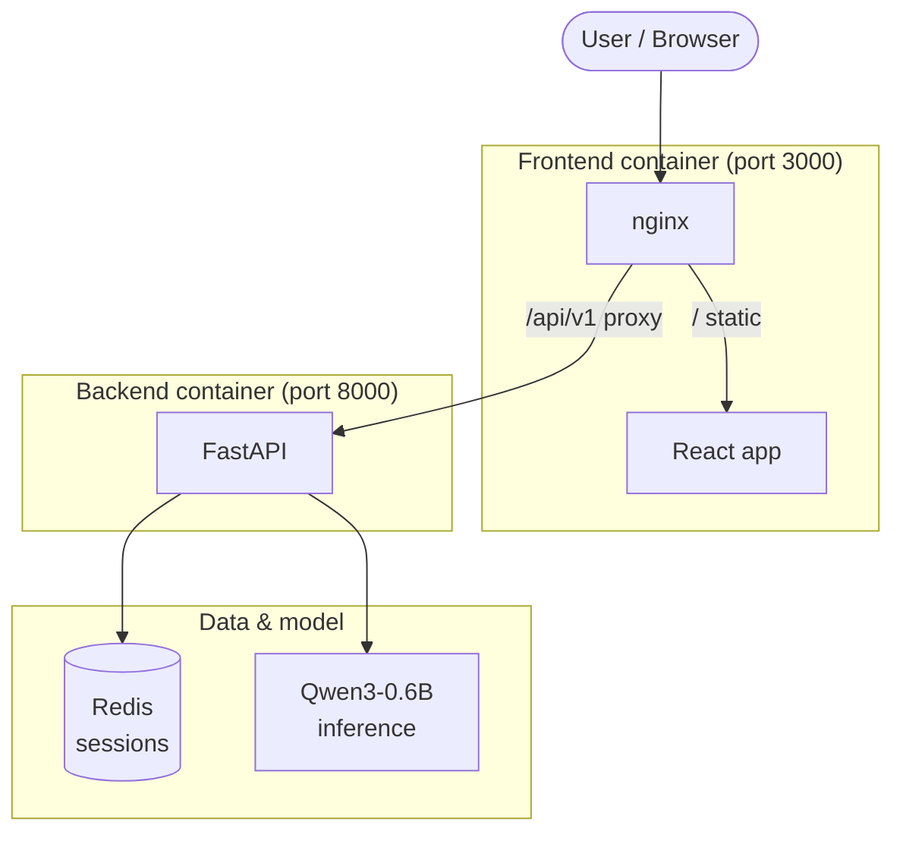

# IMessage AI Chat app (Qwen3-0.6B)

A small chat application powered by Hugging Face’s Qwen3-0.6B model, with optional chat history and session continuity.

## Demo

<iframe width="560" height="315" src="https://www.youtube.com/embed/I-ZPcHRN4mo" frameborder="0" allow="accelerometer; autoplay; clipboard-write; encrypted-media; gyroscope; picture-in-picture" allowfullscreen></iframe>

**Architecture (Docker Compose):**



---

## Build, start, and run

**Prerequisites:** Docker and Docker Compose.

From the project root:

```bash
chmod +x run.sh
./run.sh
```

This will:

1. Build and start backend, frontend, and Redis with `docker compose up --build -d`
2. Wait for the backend health check (`GET /api/v1/health` → 204)
3. Print **App is running at http://localhost:3000**

Open http://localhost:3000 in a browser to use the app.

**Useful commands:**

- Stop everything: `docker compose down`
- Stop and remove volumes: `docker compose down -v`
- View logs: `docker compose logs -f backend` or `docker compose logs -f frontend`
- Run E2E tests (with app already up): `python backend/tests/e2e.py`

---

## Technologies

| Layer      | Stack |
|-----------|--------|
| **Backend** | Python 3, FastAPI, Uvicorn, Hugging Face Transformers (PyTorch), Redis |
| **Frontend** | React 19, Vite 7, TypeScript, Tailwind CSS v4 |
| **Run**   | Docker Compose; frontend served by nginx (multi-stage build), proxying `/api/v1` to the backend |

---

## Creative choices

- **Hexagonal backend:** The backend uses a ports-and-adapters style: a `ModelService` abstraction (port) with a `QwenModelService` implementation (adapter). The API depends only on the interface, so swapping in another model (e.g. a different Hugging Face model or an external API) is a matter of adding a new adapter and wiring it in.
- **Small model:** Qwen3-0.6B was chosen so the app can run on modest hardware and start quickly, at the cost of shorter/ simpler answers.
- **Thinking and temperature:** The user can turn on “thinking” (model reasoning) and adjust the temperature per request from the UI, so they can tune creativity.
- **Sessions in Redis:** Chat history is stored in Redis with a 24-hour TTL per session, so conversations persist across page reloads without a database.
- **E2E tests:** A small script (`backend/tests/e2e.py`) checks health and one full flow (POST chat → GET session messages), runnable after `docker compose up` or in CI.
